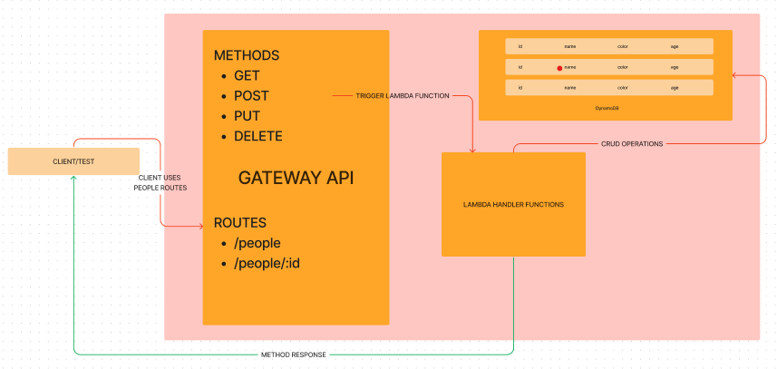
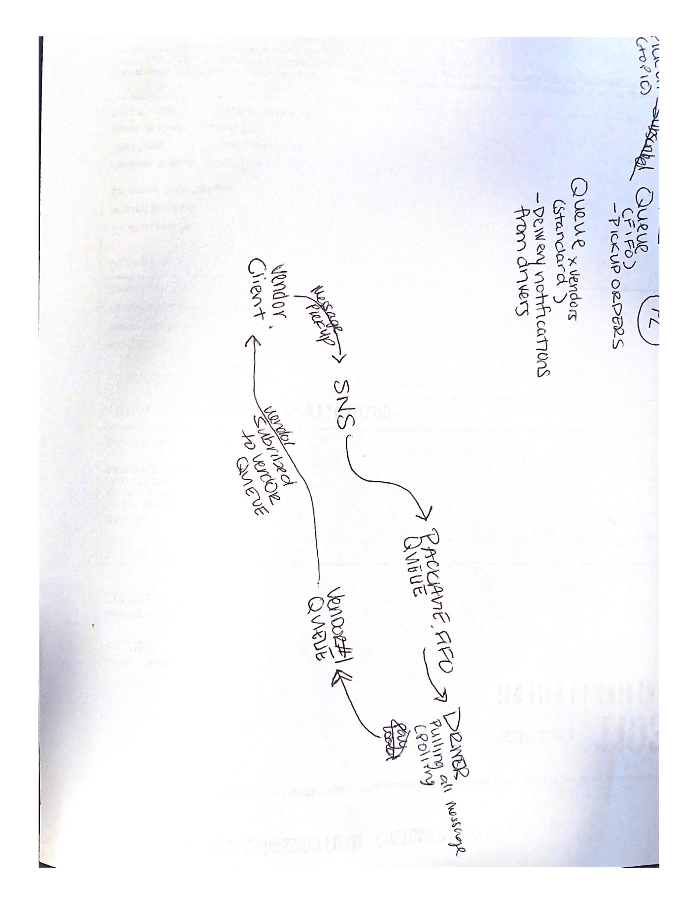

# AWS, API, Dynamo, and Lambda

## Problem domain

  A simple REST API created using a people domain model to reflect a person's age and favorite color. Dynamo table is created as people-table and API gateway contains endpoints for /people and /people/:id

  Lambda is used to create each REST method's handler (GET, GET ONE, PUT, POST, and DELETE)

## Set-up
  - npm i dynamoose

## Questions
  1. What is the root URL to your API?
    https://vcf723xbx7.execute-api.us-west-2.amazonaws.com/prod/people
  2. What are the routes?
    a. /people
    b./people/:id
  3. What inputs do they require?
    a. GET: nothing
    b. GET ONE: id path parameter
    c. PUT: id path parameter
    c. PUT: id path parameter
    c. POST: body that includes {id, name, color, age}
  4. What output do they return?
    a. GET: Returns all data from dynamo database
    b. GET ONE: Returns one specified item from dynamo database (item number 1 has been deleted)
    c. POST: Returns the object that has just been created
    d. PUT: Returns the previous object that has just been updated
    e. DELETE: Returns a string that deletion has been successful and an empty object

## AWS Gateway, Dynamo, and Lambda UML
  1. Create a table using DynamoDB and make sure to add an Id attribute.
  2. Create a Rest API through Gateway API. Add a resource /person and then add methods to the resource
  3. For each method, create a lambda function that uses dynamoose methods
    a. Make sure to npm init and install dynamoose
  4. Test each method through the API Gateway, adding body parameters and query parameters as necessary
  5. Create a deployed API through the resources tab of the API Gateway and use the invoke link to test all endpoints creates

## AWS SNS & SQS
  1. Create an SNS FIFO and add a topic
  2. Create a SQS FIFO and copy the arn to use to subscribe to a SNS topic
  3. In a code editor, create a file for a vendor/s and a ile for a driver
    a. for set up: npm init -y and install sqs-consumer and sqs-producer
  4. Vendor.js, import dependencies (AWS, Chance) and update the region. Then declare variables for the SNS arn and the SQS queue for that vendor
  5. The vendor will create a message that will be published to the SNS which will then be send to the queue FIFO. 
  6. The Driver function will be polling from the FIFO queue. When a message is recieved from the queue, the driver will create a message and send a message to the SQS queue for the vendor that was recieved by the FIFO queue - the driver's message will say the package has been delivered
  7. Once the vendor (that is subscribed to the vendor queue) will recieve the message that the package was the delivered
  8. A set interval function was used on the vendor to send out a pick up order message to the SNS every 10 seconds. These messages will be logged in the according terminals every interval

